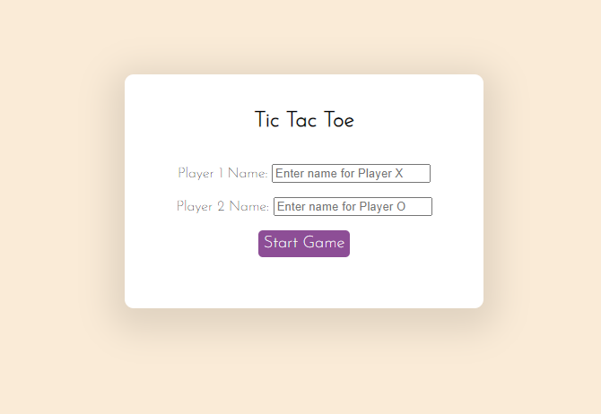
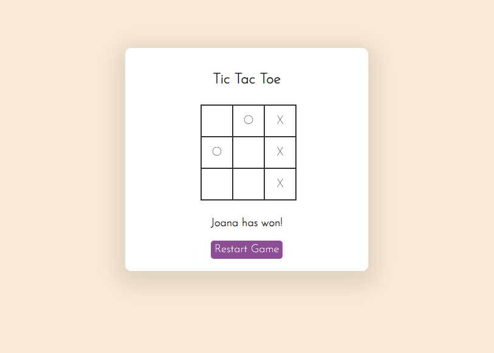

# Tic Tac Toe 🎰

A simple implementation of the classic Tic Tac Toe game using HTML, CSS, and JavaScript.

## Demonstration

## Features

- Clean and simple user interface.
- Dynamic updates to the game board based on user interactions.
- Winning condition checks for rows, columns, and diagonals.
- Prevents invalid moves (e.g., placing a mark in an already occupied cell).

## How to Play

1. Click on an empty cell to place your mark (X or O).
2. Take turns with your opponent.
3. The game will declare a winner if a player gets three in a row, column, or diagonal.
4. If the board is full with no winner, the game ends in a tie.
5. Refresh the game on the Restar Game button

## Upcoming Features

I'm working on improving the game with the following features:

- Implementing a choice of name for the players on a starting menu ✔️
- Adding a counter to verify how many times each play has won
- Add music and sound effects to make the experience more interactive